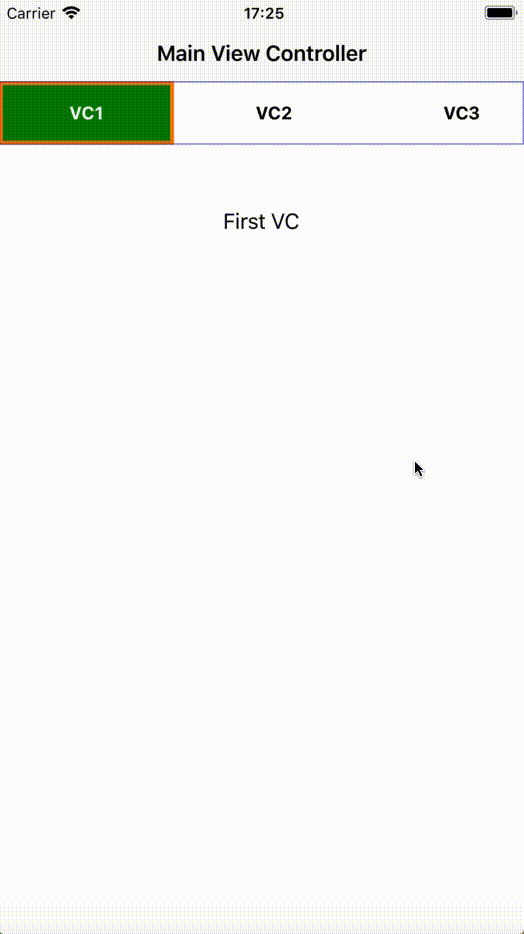

# Stepper Demo

This is simple demo created for users to make stepper view controller. It's helpful to show your multi-forms data via single view controller inside stepper. By scrolling or selecting segment at top, you can change view controller.

## Getting Started

First, download this simple demo app and looks up inside storyboard. I have used Auto Layout to layout container view inside single view controller.

Every container view has embedd with their separate view controller, So it's easy write and manage bunch of code for single view controller.

### MainVC

This is main view controller where scrolls and selection managing to change view controller.

Currently there are 9 view controller take for demo app, you can add and remove it as per your requirements.

    

